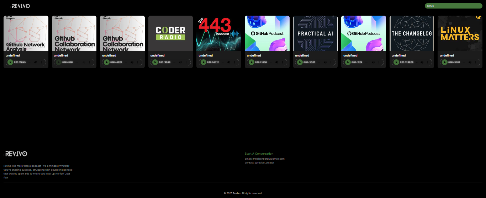

# 🎙️ Revivo Podcast App

**Revivo** is more than a podcast — it's a mindset. Whether you're chasing success, struggling with doubt, or just need that weekly spark, this is where you level up.  
_No fluff. Just fuel._

---

## 🚀 Live Preview
*(Replace with your deployed link if hosting on Vercel, Render, or Netlify)*  

---

## 📸 Output Preview

 <!-- Take a screenshot of your app and save as screenshot.png -->

---

## 📖 Features
- **Trending Podcasts** fetched from ListenNotes API
- **Search Functionality** with real-time API results
- **Dark/Light Theme Toggle**
- **Responsive Design** for mobile and desktop
- **Built-in Audio Player** for each podcast

---

## 🛠️ Tools & Technologies
### Frontend:
- **HTML5** – Page structure
- **CSS3** – Styling and layout
- **JavaScript** – DOM manipulation & API calls

### Backend:
- **Node.js & Express** – Server and API routes
- **CORS** – Cross-origin handling
- **dotenv** – Environment variables
- **ListenNotes API** – Podcast data source

---

## 📂 Project Structure

---
