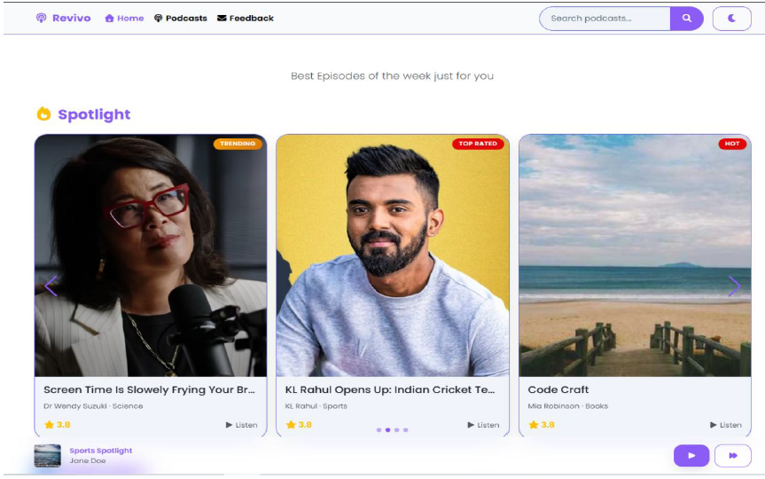
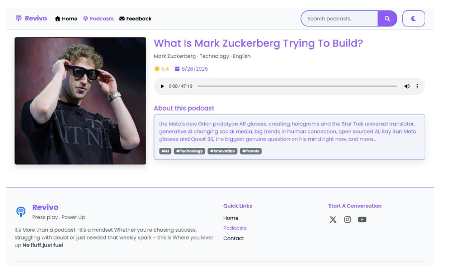
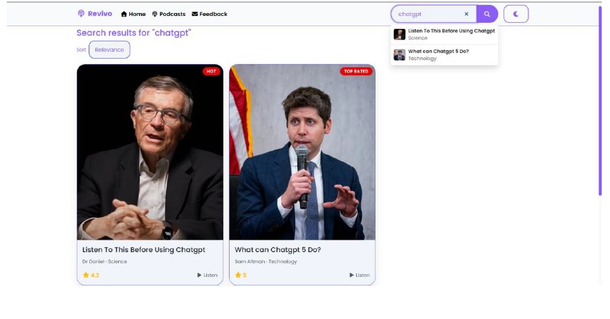

## PROJECT DESCRIPTION
REVIVO Podcast Website is a responsive web platform designed to present and promote podcast content through a clean and engaging interface. The website allows users to explore podcast episodes, learn about the podcast series, and access multimedia content easily. It demonstrates frontend development skills with a focus on usability, responsive design, and structured web layouts.
## KEY FEATURES

* Responsive design compatible with desktop and mobile devices
* Clean and user-friendly interface for podcast navigation
* Dedicated sections for podcast episodes and information
* Multimedia integration for audio content
* Structured layout for easy content presentation
* Fast and lightweight frontend implementation

## TECH STACK

* HTML5 – Structure and content of the website
* CSS3 – Styling, layout, and responsive design
* JavaScript – Interactive elements and functionality

## Website Preview

### Home Page

### PodcastList Page

### PodacastDetails

### Search Results

### Feedback Page

